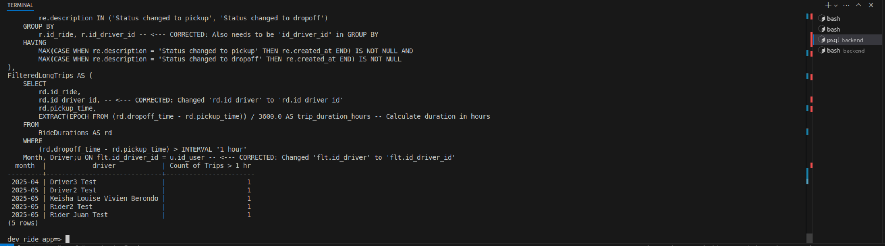
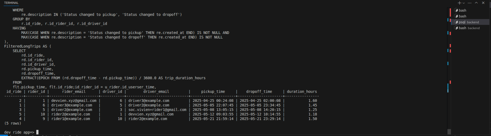

# Bonus: Long Trip Report SQL Query

This document provides the raw SQL query to generate a report on trips that exceeded a duration of 1 hour from pickup to dropoff. This report is grouped by month and by the driver responsible for the trip.

This query addresses the bonus requirement of the assessment, demonstrating the ability to perform complex data aggregation and analysis directly at the database level.



---

## Query Logic

The query operates in several logical steps using Common Table Expressions (CTEs) for clarity:

1. **`RideDurations`**: Identifies the `pickup_time` and `dropoff_time` for each `id_ride` by parsing the `description` in the `Ride_Event` table. It ensures that only rides with both a pickup and a dropoff event are considered.
2. **`FilteredLongTrips`**: Calculates the duration of each ride in hours and then filters these rides, keeping only those where the duration is greater than 1 hour.
3. **Final Selection and Aggregation**: Joins the filtered results with the `User` table to get driver names, formats the `pickup_time` into a 'YYYY-MM' month string, and finally counts the number of long trips, grouping by month and driver.

---

## Raw SQL Query

```sql
WITH RideDurations AS (
    SELECT
        r.id_ride,
        r.id_driver_id, -- <--- CORRECTED: Changed 'r.id_driver' to 'r.id_driver_id'
        MAX(CASE WHEN re.description = 'Status changed to pickup' THEN re.created_at END) AS pickup_time,
        MAX(CASE WHEN re.description = 'Status changed to dropoff' THEN re.created_at END) AS dropoff_time
    FROM
        ride_ride AS r
    JOIN
        ride_rideevent AS re ON r.id_ride = re.id_ride_id
    WHERE
        re.description IN ('Status changed to pickup', 'Status changed to dropoff')
    GROUP BY
        r.id_ride, r.id_driver_id -- <--- CORRECTED: Also needs to be 'id_driver_id' in GROUP BY
    HAVING
        MAX(CASE WHEN re.description = 'Status changed to pickup' THEN re.created_at END) IS NOT NULL AND
        MAX(CASE WHEN re.description = 'Status changed to dropoff' THEN re.created_at END) IS NOT NULL
),
FilteredLongTrips AS (
    SELECT
        rd.id_ride,
        rd.id_driver_id, -- <--- CORRECTED: Changed 'rd.id_driver' to 'rd.id_driver_id'
        rd.pickup_time,
        EXTRACT(EPOCH FROM (rd.dropoff_time - rd.pickup_time)) / 3600.0 AS trip_duration_hours -- Calculate duration in hours
    FROM
        RideDurations AS rd
    WHERE
        (rd.dropoff_time - rd.pickup_time) > INTERVAL '1 hour'
)
SELECT
    TO_CHAR(flt.pickup_time, 'YYYY-MM') AS Month,
    u.first_name || ' ' || u.last_name AS Driver,
    COUNT(flt.id_ride) AS "Count of Trips > 1 hr"
FROM
    FilteredLongTrips AS flt
JOIN
    users_user AS u ON flt.id_driver_id = u.id_user -- <--- CORRECTED: Changed 'flt.id_driver' to 'flt.id_driver_id'
GROUP BY
    Month, Driver
ORDER BY
    Month, Driver;
```

## Sample Report Output

Below is an example of the kind of output this query would produce:

Month  | Driver     | Count of Trips > 1 hr
------- | ----------- | ---------------------
2024-01  | Chris H    |   4
2024-01 |  Howard Y   |   5
2024-01 |  Randy W    |   2
2024-02 |  Chris H    |   7
2024-02 |  Howard Y   |   5
2024-03 |  Chris H    |   2
2024-03  | Howard Y   |   2
2024-03 |  Randy W   |    11
2024-04 |  Howard Y  |    7
2024-04 |  Randy W   |    3

## Testing out the raw sql query, locally

```bash
# ensure postgres service is running
sudo systemctl start postgresql

# connect to db
psql -h localhost -U admin_ride_app -d dev_ride_app

# execute the query
# copy paste the raw sql query to the terminal once connected to the db
```

## [Bonus] Detailed long trip sql query report



This was generated using the raw sql query from `sql_scripts/long_trip_detailed.sql`.
