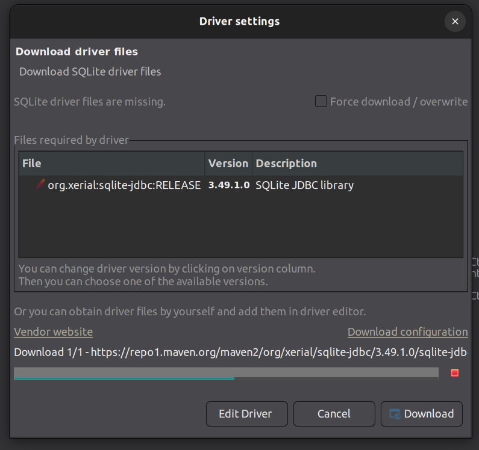

# Tools

## [DBeaver](https://dbeaver.io/download/)

```bash
sudo  wget -O /usr/share/keyrings/dbeaver.gpg.key https://dbeaver.io/debs/dbeaver.gpg.key
echo "deb [signed-by=/usr/share/keyrings/dbeaver.gpg.key] https://dbeaver.io/debs/dbeaver-ce /" | sudo tee /etc/apt/sources.list.d/dbeaver.list
sudo apt-get update && sudo apt-get install dbeaver-ce
```

Install missing drivers if prompted.



