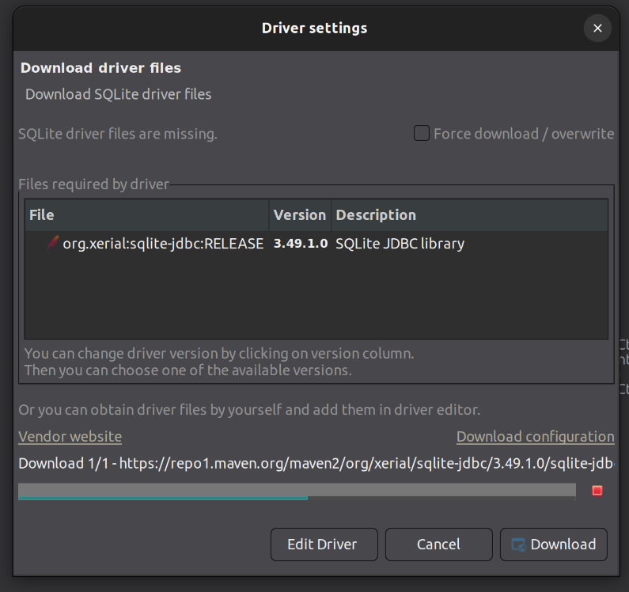
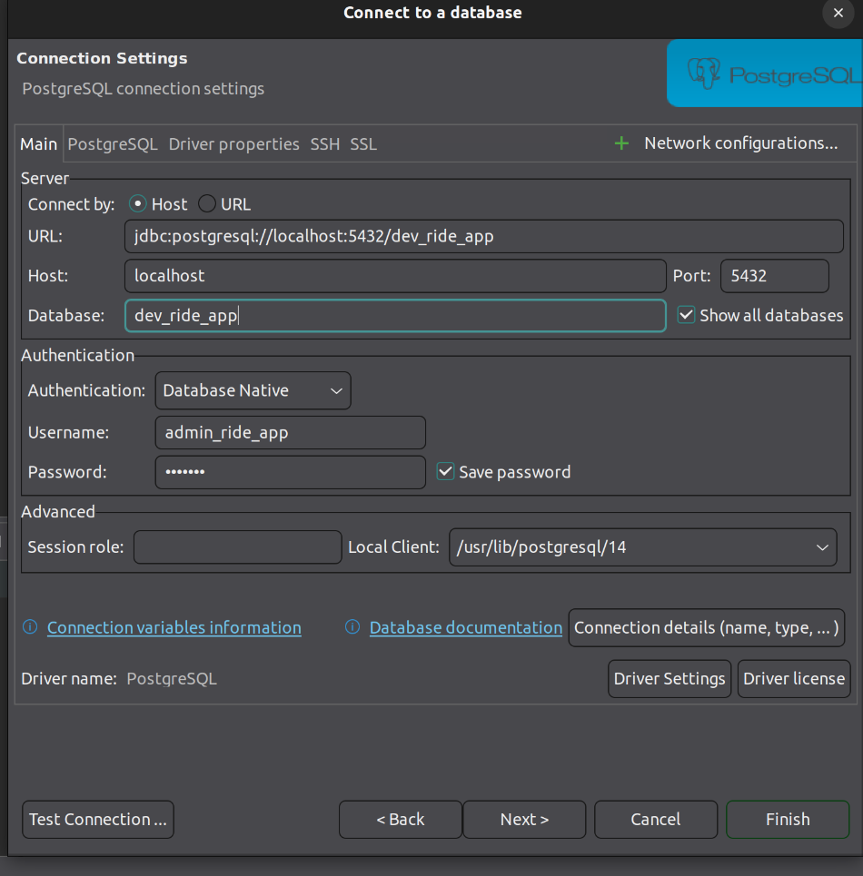
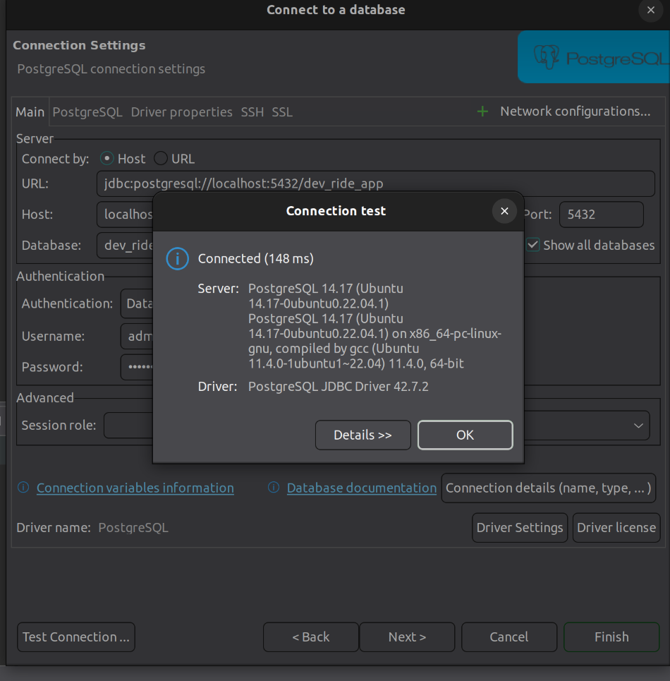
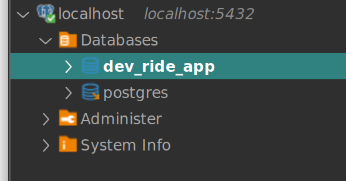

# Tools

## [DBeaver](https://dbeaver.io/download/)

1. Install DBeaver.

   ```bash
   sudo  wget -O /usr/share/keyrings/dbeaver.gpg.key https://dbeaver.io/debs/dbeaver.gpg.key
   echo "deb [signed-by=/usr/share/keyrings/dbeaver.gpg.key] https://dbeaver.io/debs/dbeaver-ce /" | sudo tee /etc/apt/sources.list.d/dbeaver.list
   sudo apt-get update && sudo apt-get install dbeaver-ce
   ```

2. Open the DBeaver software and install missing drivers if prompted.

   
   

3. Add a new connection and configure the new instance.

   

4. Test the connection. You should see a success prompt like this:

   

5. You should see the list of databases under the new connection.

   
